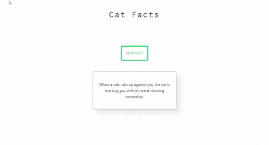

# Description

Simple display made with React that fetches cat facts from an API and shows the user. A button can be pressed to update the state of the fact with a new one.

This is just to implement the basics of React that I just learned: State, props and dividing into components. 

# Demo

